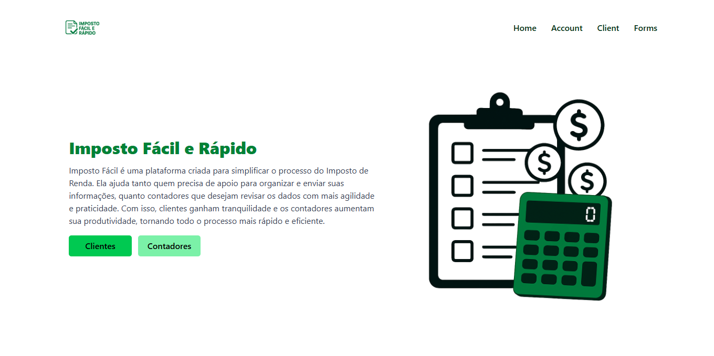

# 💸 Imposto Fácil e Rápido

Imposto Fácil e Rápido é um **MVP pessoal** criado para simplificar o processo do **Imposto de Renda**.  
A ideia é ajudar tanto **clientes**, que precisam de apoio para organizar e enviar suas informações, quanto **contadores**, que desejam revisar os dados com mais agilidade e praticidade.

## 🚀 Funcionalidades (MVP)

- 📋 Formulário para preenchimento de dados pessoais e rendimentos  
- 👨‍💼 Área dedicada para **Clientes**  
- 📊 Área dedicada para **Contadores**  
- 🖥️ Interface simples, responsiva e fácil de usar  

## 🎯 Objetivo

O objetivo principal é criar uma plataforma que facilite a comunicação e organização de dados entre clientes e contadores, tornando o processo de declaração do Imposto de Renda mais rápido e eficiente.

## 🛠️ Tecnologias Utilizadas

- **React** (com Vite) ⚛️  
- **JavaScript / TypeScript**  
- **TailwindCSS** para estilização  
- **Git e GitHub** para versionamento  

## 📸 Preview do Projeto



## 📦 Como rodar o projeto localmente

1. Clone este repositório:
   ```bash
   git clone https://github.com/SEU-USUARIO/imposto-facil-rapido.git


2. Entre na pasta do projeto:
```bash
cd imposto-facil-rapido


3. Instale as dependências:
```bash
npm install


4. Rode o projeto:
```bash
npm run dev


5. Acesse no navegador:
```bash

http://localhost:5173